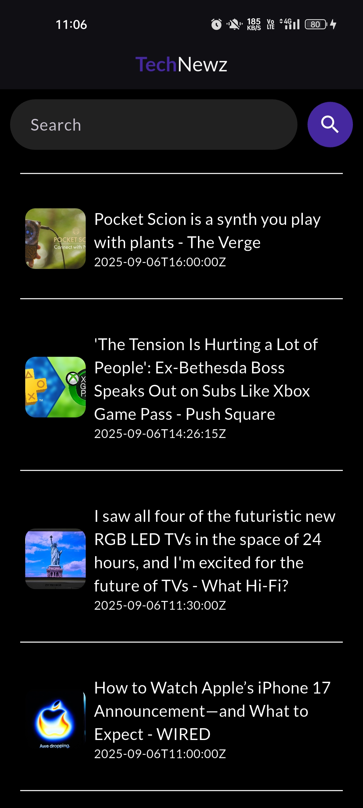
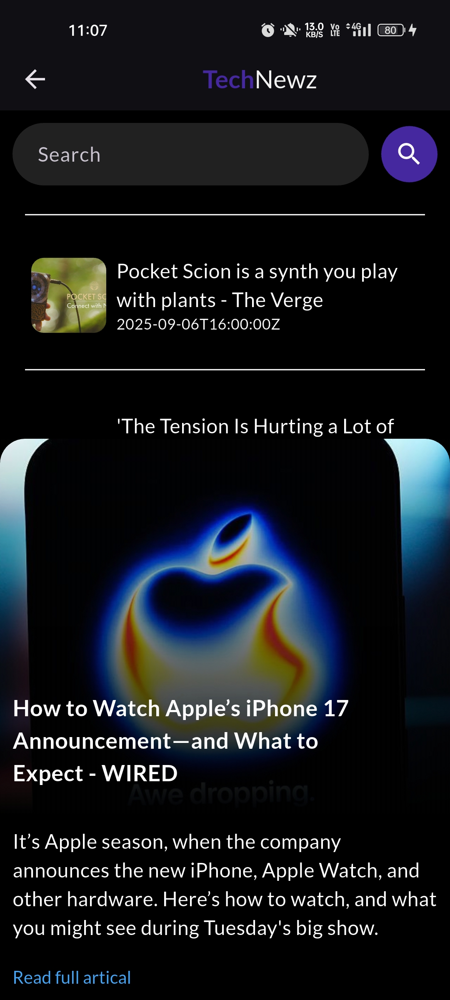

  

<h1 align="center">TechNewz – News Aggregator App</h1>

## 📖 About
TechNewz is a **Flutter-based News Aggregator App** that fetches the latest technology news using the [NewsAPI](https://newsapi.org/).  
It provides users with a smooth, modern UI to **search, explore, and read** articles in real-time.

---

## ✨ Features
- 🔍 **Search News** – find articles by keyword
- 📰 **Top Headlines** – fetches latest tech news
- 🌙 **Dark Theme** – sleek, minimal UI
- 📱 **Responsive UI** – works on all screen sizes
- 🌐 **Open Full Articles** – read complete stories in browser
- ⚡ **Optimized API Calls** – fast fetching and rendering
- 🎨 **Custom Widgets** – re-usable `Newsbox`, `AppBar`, `Searchbar`

---

## 🛠 Tech Stack
- **Flutter & Dart**
- **NewsAPI.org** (News Data Provider)
- **HTTP Package** (API calls)
- **Google Fonts** (Custom Typography)
- **Custom Widgets** (Searchbar, AppBar, BottomSheet, Newsbox)

---

## 📱 App Screenshots

   &nbsp;&nbsp;
   &nbsp;&nbsp;
   

---
## 📚 References
1. [NewsAPI Documentation](https://newsapi.org/docs)
2. [Flutter Official Docs](https://docs.flutter.dev/)
3. [Dart Packages](https://pub.dev/)
4. [Google Fonts](https://fonts.google.com/)

---

## 👨‍💻 Developed By
- *Prem Kamothi*
